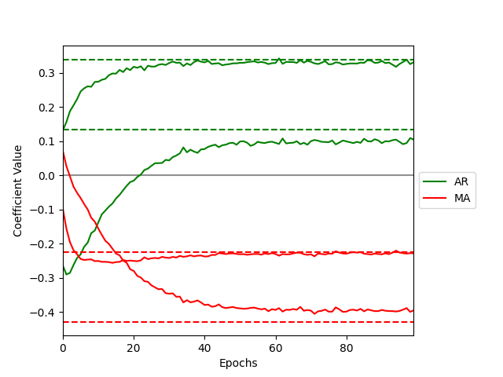

# ARMA cell: a modular and effective approach for neural autoregressive modeling


[](https://github.com/psf/black)

## Installation

The ARMA cell can be installed using `pip` as follows

```python
pip install git+https://github.com/phschiele/armacell.git
```

## Getting started

The syntax of the ARMA cell is similar to existing RNN models in tensorflow, with the additional parameter q for the numer of MA lags.
The number of AR lags are already represented in the preprocessed data.

Below is an example using the functional model API
```python
x = ARMA(q, input_dim=(n_features, p), units=1, activation="relu", use_bias=True)(x)
 ```

The syntax for the ConvARMA cell is also similar to existing spatiotemporal RNN models. If "return_lags" is True, a subsequent
ConvARMA layer will itself have multiple lags.
```python
x = ConvARMA(
    activation="relu",
    units=64,
    q=3,
    image_shape=image_shape,
    kernel_size=(3, 3),
    return_lags=False,
    return_sequences=True
)(x)
```

## Minimum working example
```python
import numpy as np
from statsmodels.tsa.arima.model import ARIMA
from tensorflow import keras

from armacell import ARMA
from armacell.helpers import simulate_arma_process, prepare_arma_input, SaveWeights, set_all_seeds
from armacell.plotting import plot_convergence

# 1. Obtain time series data. Simulating an ARMA process here for simplicity

arparams = np.array([0.1, 0.3])
maparams = np.array([-0.4, -0.2])
alpha = 0
set_all_seeds()
y = simulate_arma_process(arparams, maparams, alpha, n_steps=25000, std=2)

# 2. Data pre-processing.
# In practice, p and q are hyperparameters. Here, we use the true values.
p, q = len(arparams), len(maparams)
X_train, y_train = prepare_arma_input(max(p, q), y)

# 3. Fit the model
tf_model = keras.Sequential(
    [
        ARMA(q=q, input_dim=X_train.shape[2:]),
    ]
)
tf_model.compile(loss="mse", optimizer="adam")
callback = [SaveWeights()]  # We add a callback to plot the convergence later
tf_model.fit(X_train, y_train, epochs=100, batch_size=100, callbacks=callback, verbose=True)

# 4. Fit a classical ARMA model for comparison
arma_model = ARIMA(endog=y, order=(p, 0, q), trend="n").fit()

# 5. Plot the result
plot_convergence(tf_model, p, add_intercept=False, arima_model=arma_model, path="example.png")
```

Looking at the convergence plot, the ARMA cell converged to the true parameters at least as good
as a classical ARIMA model.




## Test
Unit and regression tests are handled through `pytest`, which can be installed via `pip install pytest`.
To run all tests, simply execute
```shell
pytest
```
from the root of the repository.
